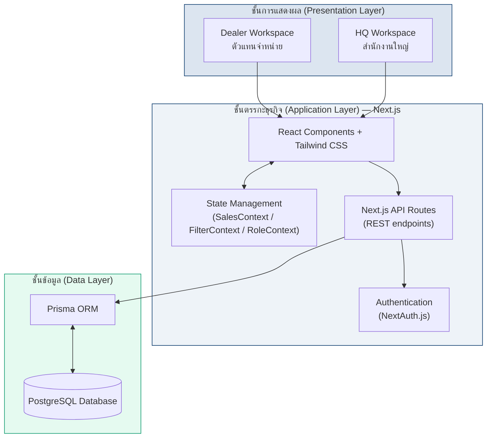
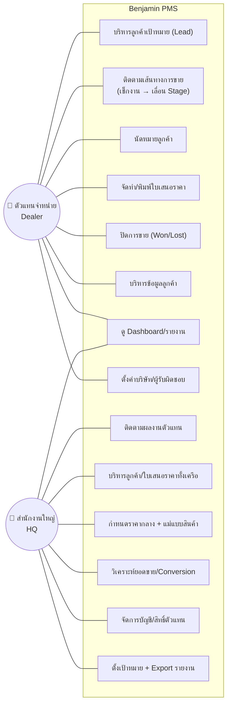
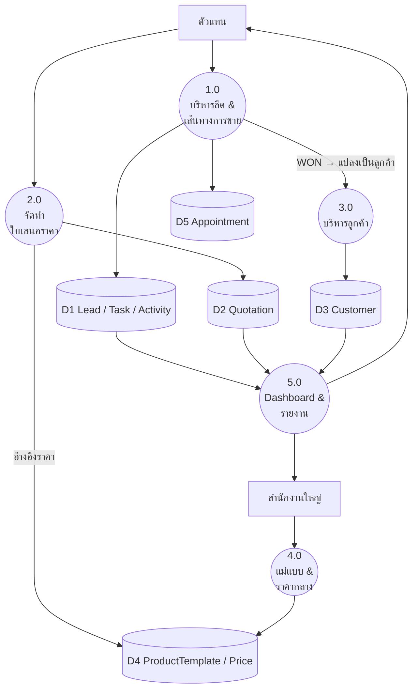
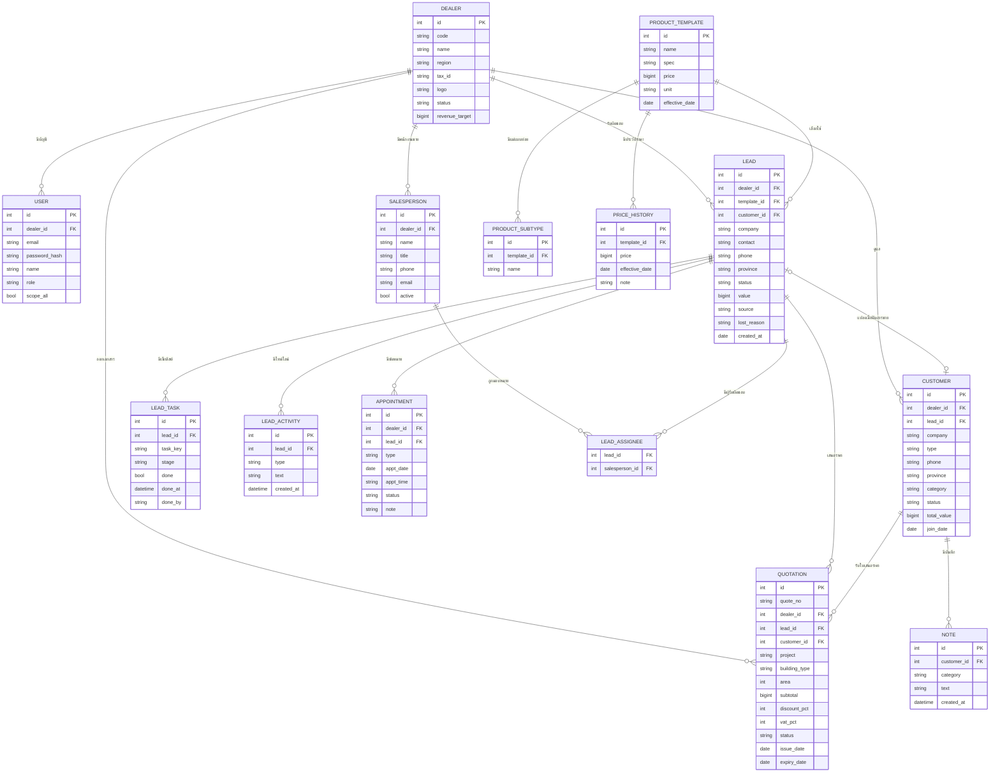

# เอกสารออกแบบระบบ — Benjamin PMS
### แพลตฟอร์มบริหารงานขายและตัวแทนจำหน่ายสำหรับธุรกิจอาคารเหล็กสำเร็จรูป
*(Sales and Dealer Management Platform for the Pre-Engineered Building Industry)*

> ผู้พัฒนา: นายรัฐนันท์ วังใจชิด · รหัส 68409010021
> เอกสารนี้อ้างอิงโครงสร้างข้อมูลและฟังก์ชันจากระบบที่พัฒนาจริง (เฟส Front-end + Mock Data)

---

## 1. สถาปัตยกรรมระบบ (System Architecture)

ระบบออกแบบเป็น **3-Tier Web Application** แยกการแสดงผล ตรรกะทางธุรกิจ และการจัดเก็บข้อมูลออกจากกัน

| ชั้น | เทคโนโลยี | หน้าที่ |
|------|-----------|---------|
| Presentation | React, Tailwind CSS | แสดงผล 2 workspace แยกสิทธิ์ |
| Application | Next.js (App Router), API Routes, NextAuth.js | ตรรกะธุรกิจ + สิทธิ์ผู้ใช้ + Task-driven Sales Journey |
| Data | Prisma ORM, PostgreSQL | จัดเก็บ/สอบถามข้อมูลแบบรวมศูนย์ |
| Deployment | Vercel · Git/GitHub | โฮสต์ + จัดการเวอร์ชัน |

> **หมายเหตุเฟสปัจจุบัน:** ระบบยังทำงานเป็น Front-end-only โดยจำลองชั้นข้อมูลด้วย `localStorage` (Mock Data) เฟสถัดไปคือแทนที่ด้วย API Routes + Prisma + PostgreSQL ตามสถาปัตยกรรมข้างต้น

---

## 2. แผนภาพ Use Case (Use Case Diagram)

**Actors:** พนักงานขาย/ผู้จัดการตัวแทน (Dealer) · ผู้บริหารสำนักงานใหญ่ (HQ)
*ลูกค้า (Customer) = ข้อมูลในระบบ ไม่ใช่ Actor*

---

## 3. แผนภาพกระแสข้อมูล (Data Flow Diagram)

### 3.1 Context Diagram (Level 0)

### 3.2 DFD Level 1

---

## 4. แผนภาพความสัมพันธ์ข้อมูล (ER Diagram)

---

## 5. การออกแบบฐานข้อมูล (Database Design)

### 5.1 พจนานุกรมข้อมูล (Data Dictionary — ตารางหลัก)

**ตาราง `dealer` — ตัวแทนจำหน่าย**
| ฟิลด์ | ชนิด | คำอธิบาย |
|-------|------|----------|
| id | SERIAL PK | รหัสตัวแทน |
| code | VARCHAR(8) UNIQUE | รหัสย่อ เช่น CNX, RYG |
| name | VARCHAR | ชื่อบริษัทตัวแทน |
| region | VARCHAR | ภูมิภาค |
| tax_id, phone, email, address | VARCHAR | ข้อมูลบริษัท (ออกใบเสนอราคาในนามนี้) |
| logo, wordmark | TEXT | โลโก้สัญลักษณ์ / โลโก้พร้อมชื่อ |
| revenue_target | BIGINT | เป้ายอดขาย |
| status | VARCHAR | active / inactive |

**ตาราง `user` — ผู้ใช้ระบบ**
| ฟิลด์ | ชนิด | คำอธิบาย |
|-------|------|----------|
| id | SERIAL PK | |
| dealer_id | INT FK → dealer(id) | NULL = ผู้ใช้ HQ |
| email | VARCHAR UNIQUE | ใช้ล็อกอิน |
| password_hash | VARCHAR | รหัสผ่าน (เข้ารหัส) |
| name | VARCHAR | ชื่อผู้ใช้ |
| role | ENUM | HQ_MANAGEMENT / DEALER_ADMIN / DEALER_SALES / DEALER_SITE |
| scope_all | BOOLEAN | true = เห็นทุกตัวแทน (HQ) |

**ตาราง `salesperson` — ผู้รับผิดชอบ/พนักงานขาย** *(ไม่ใช่ผู้ใช้ระบบ — ใช้กำกับลีด/ลูกค้า)*
| ฟิลด์ | ชนิด | คำอธิบาย |
|-------|------|----------|
| id | SERIAL PK | |
| dealer_id | INT FK | สังกัดตัวแทน |
| name, title, phone, email | VARCHAR | ข้อมูลพนักงาน |
| active | BOOLEAN | สถานะใช้งาน |

**ตาราง `lead` — ลูกค้าเป้าหมาย**
| ฟิลด์ | ชนิด | คำอธิบาย |
|-------|------|----------|
| id | SERIAL PK | |
| dealer_id | INT FK | |
| template_id | INT FK → product_template | แม่แบบ/แม่แบบย่อยที่สนใจ |
| customer_id | INT FK → customer | NULL จนกว่าปิดการขาย (WON) |
| company, contact, phone, email, province | VARCHAR | ข้อมูลผู้สนใจ |
| status | ENUM | WAITING / BULLET / QUOTED / FOLLOWUP / NEGO / PAID / CANCELLED |
| value | BIGINT | มูลค่าคาดการณ์ |
| source | VARCHAR | ช่องทางที่มา |
| lost_reason | VARCHAR | เหตุผล (เมื่อ CANCELLED) |
| created_at | DATE | |

**ตาราง `lead_task` — เช็กลิสต์งาน (Task-driven Sales Journey)**
| ฟิลด์ | ชนิด | คำอธิบาย |
|-------|------|----------|
| id | SERIAL PK | |
| lead_id | INT FK | |
| task_key | VARCHAR | contact / requirement / makeQuote / … |
| stage | ENUM | Stage ที่งานนี้พาไปถึง |
| done | BOOLEAN | เช็กแล้ว → คำนวณ % + เลื่อน Stage อัตโนมัติ |
| done_at, done_by | TIMESTAMP / VARCHAR | เวลา + ผู้ทำ |

**ตาราง `quotation` — ใบเสนอราคา**
| ฟิลด์ | ชนิด | คำอธิบาย |
|-------|------|----------|
| id | SERIAL PK | |
| quote_no | VARCHAR UNIQUE | เลขที่เอกสาร เช่น Q-2026-1001 |
| dealer_id, lead_id, customer_id | INT FK | |
| project, building_type | VARCHAR | โครงการ + แม่แบบ |
| area | INT | พื้นที่ (ตร.ม.) |
| subtotal, discount_pct, vat_pct | NUMBER | คำนวณยอดสุทธิ |
| status | ENUM | draft / sent_to_client / viewed / won / lost / expired |
| issue_date, expiry_date | DATE | |

**ตาราง `appointment` — นัดหมาย** · **`customer`** · **`product_template` / `product_subtype` / `price_history`** · **`note`** · **`sales_target`** — โครงสร้างตาม ER Diagram ข้อ 4

### 5.2 กฎความสัมพันธ์สำคัญ (Business Rules)
1. **1 Dealer = 1 บัญชีหลัก** แต่มี `salesperson` ได้หลายคน (ผู้รับผิดชอบ ≠ ผู้ใช้ระบบ)
2. **Lead → Customer** เกิดขึ้นอัตโนมัติเมื่อ `lead.status = PAID` (ปิดการขายสำเร็จ)
3. **ผู้รับผิดชอบต่อลีดเป็นแบบหลายคน** → ตาราง junction `lead_assignee` (Many-to-Many)
4. **ราคากลาง (`product_template.price`) กำหนดโดย HQ เท่านั้น** — ทุกตัวแทนอ่านชุดเดียวกัน + เก็บ `price_history` ทุกครั้งที่ปรับ
5. **ใบเสนอราคาออกในนาม Dealer** (ใช้ `dealer.name/logo/tax_id`) ไม่ใช่สำนักงานใหญ่
6. **แม่แบบย่อย roll-up สู่แม่แบบหลัก** ตอนจัดกลุ่ม/รายงาน

---

## 6. ขอบเขตระบบ (ยืนยันจากการออกแบบ)
**อยู่ในระบบ:** Login+สิทธิ์ · Lead · Customer · Sales Pipeline · Quotation · Product/ราคากลาง · Dashboard · Report · Search/Filter · Export CSV/PDF
**ไม่อยู่ในระบบ (Sales-only):** บัญชี · คลังสินค้า · จัดซื้อ · การผลิต · ก่อสร้าง · ติดตั้ง · ซ่อมบำรุง · Mobile App
